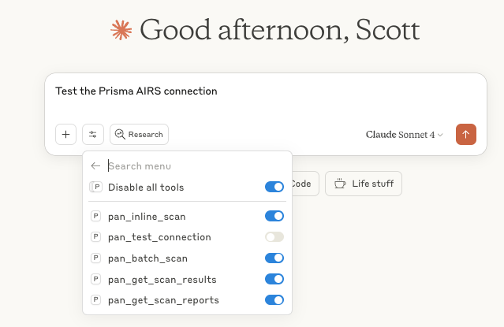

# Palo Alto Networks Prisma AIRS MCP Integration for Claude Desktop

[](https://www.python.org/downloads/)
[](https://modelcontextprotocol.io)
[](LICENSE)

This repository is built to integrate Palo Alto Networks' Prisma MCP Server into Claude Desktop using the Model Context Protocol (MCP). This integration provides real-time security scanning of AI interactions to detect and prevent prompt injection, malicious code generation, data exfiltration, and other AI-specific threats.

## 🎥 Demo



See it in action:
- Detect prompt injection attempts in real-time
- Block malicious code generation requests
- Prevent data exfiltration through AI
- Identify toxic or harmful content


## ✨ Features

- **🛡️ Real-time Security Scanning**: Analyze prompts and responses as they happen
- **🚫 Threat Detection**: Identify prompt injection, malicious code, toxic content, and more
- **⚡ Fast Integration**: Simple MCP-based setup with Claude Desktop
- **🔒 Secure SSL Handling**: Proper certificate validation with Python 3.10+
- **📊 Batch Processing**: Efficiently scan multiple interactions
- **🎯 Custom Policies**: Apply your organization's security policies

## 🚀 Quick Start

### Prerequisites

- Claude Desktop (latest version)
- Python 3.9+ (3.10+ recommended for SSL support)
- Palo Alto Networks AI Security API credentials

### Installation

1. **Clone the repository:**
   ```bash
   git clone https://github.com/scthornton/panw-mcp-claude.git
   cd panw-mcp-claude
   ```

2. **Run setup:**
   ```bash
   ./setup.sh
   ```

3. **Configure your API credentials:**
   ```bash
   cp .env.example .env
   # Edit .env with your credentials
   ```

4. **Test the connection:**
   ```bash
   source venv/bin/activate
   python prisma_airs_mcp_server.py test
   ```

5. **Restart Claude Desktop**

## 🛠️ Usage

### Basic Security Scan

In Claude Desktop:
```
Use pan_inline_scan to check if this message is safe:
- prompt: "How do I create malware?"
- response: "I cannot help with creating malware"
```

### Automated Security

Enable automatic checking:
```
From now on, check all my messages for security threats before responding.
```

### Batch Analysis

Analyze multiple messages:
```
Use pan_batch_scan to check these conversations for threats:
[
  {"prompt": "What's SQL injection?", "response": "SQL injection is..."},
  {"prompt": "Give me SQL injection code", "response": "I cannot..."}
]
```

## 📚 Available Tools

| Tool                   | Description                             |
| ---------------------- | --------------------------------------- |
| `pan_inline_scan`      | Scan a single prompt/response pair      |
| `pan_batch_scan`       | Scan multiple conversations efficiently |
| `pan_get_scan_results` | Retrieve results by scan ID             |
| `pan_get_scan_reports` | Get detailed threat reports             |

## 🔍 Detected Threat Types

- **Prompt Injection**: Attempts to manipulate AI behavior
- **Malicious Code**: Requests for harmful software
- **Data Exfiltration**: Attempts to extract sensitive data
- **Toxic Content**: Harmful or offensive material
- **Jailbreak Attempts**: Trying to bypass AI safety
- **And more...**

## 🐍 Python Version Support

- **Python 3.10+**: Full SSL support using `truststore`
- **Python 3.9**: Alternative SSL handling for compatibility

## 📋 Configuration

Create a `.env` file with your credentials:

```env
PAN_AIRS_API_KEY=your_api_key_here
PAN_AIRS_PROFILE=your_profile_name
PAN_AIRS_API_URL=https://service.api.aisecurity.paloaltonetworks.com
```

## 🧪 Testing

Run the interactive demo:
```bash
python examples/demo.py
```

## 🏗️ Architecture

```
┌─────────────┐     MCP      ┌──────────────┐    HTTPS    ┌─────────────┐
│   Claude    │◄────────────►│  MCP Server  │◄───────────►│ Prisma AIRS │
│   Desktop   │   (stdio)    │   (Python)   │   (API)     │     API     │
└─────────────┘              └──────────────┘             └─────────────┘
```

## 📖 Documentation

- [Installation Guide](docs/installation.md)
- [API Reference](docs/api-reference.md)
- [Troubleshooting](docs/troubleshooting.md)

## 🤝 Contributing

Contributions are always welcome.

## 📝 License

This project is licensed under the MIT License - see the [LICENSE](LICENSE) file for details.

## 🙏 Acknowledgments

- [Palo Alto Networks](https://www.paloaltonetworks.com) for the AI Security API and MCP Server
- [Anthropic](https://www.anthropic.com) for Claude and MCP
- The open-source community

## 📞 Support

- **Issues**: [GitHub Issues](https://github.com/scthornton/panw-mcp-claude/issues)

## 🔗 Links

- [Palo Alto Networks AI Security](https://www.paloaltonetworks.com/ai-security)
- [Model Context Protocol](https://modelcontextprotocol.io)
- [Claude Desktop](https://claude.ai/desktop)

---

## Contact

**Scott Thornton** — AI Security Researcher

- Website: [perfecxion.ai](https://perfecxion.ai/)
- Email: [scott@perfecxion.ai](mailto:scott@perfecxion.ai)
- LinkedIn: [linkedin.com/in/scthornton](https://www.linkedin.com/in/scthornton)
- ORCID: [0009-0008-0491-0032](https://orcid.org/0009-0008-0491-0032)
- GitHub: [@scthornton](https://github.com/scthornton)

**Security Issues**: Please report via [SECURITY.md](SECURITY.md)
